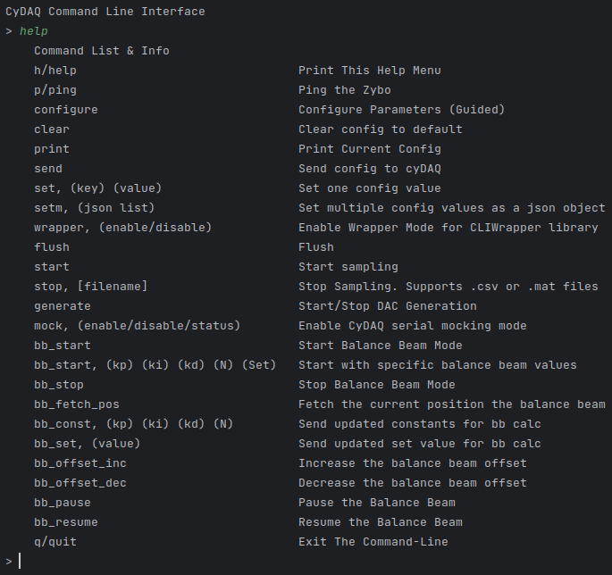

# CyDAQ - ISU Senior Design 22-23
- Blake Fisher
- Cole Langner
- Corbin Kems
- Jens Rasmussen
- Long Zeng
- Wyatt Duberstein
- Yohan Bopearatchy
---

# Wiki
To view all of our official documentation for this project, check out our [wiki](https://git.ece.iastate.edu/sd/sdmay23-47/-/wikis/home)!

# Hardware
Hardware Design is using Vivado 2020.1, it is NOT backwards compatible.

The Hardware Design folder is located under /firmware-dual-core/CyDAQ_proto_1/

Open CyDAQ_proto_1.xpr in Vivado to view/modify to project.

# Firmware
The bare-metal firmware design is under /firmware-dual-core/workspace/ import this folder in Vitis as a workspace to view/modify.

For the linux firmware, it is using petalinux tools, you need a linux environment to view.edit it. The petalinux project is under /firmware-petalinux/os/ the Vitis project for linux is under /firmware-petalinux/platform/

For more detail, check the [petalinux pages](https://git.ece.iastate.edu/sd/sdmay23-47/-/wikis/Petalinux-(Firmware)) on [wiki](https://git.ece.iastate.edu/sd/sdmay23-47/-/wikis/home).


# CLI
The Command Line Tool, or CLI for short, is a console-based application used to interface directly with the cyDAQ. 

It works by storing a local configuration for the cyDAQ, making it easily editable without sending any data to the cyDAQ itself. Then, when the config is ready, a command can be used to send all config values to the cyDAQ at once.  



## Install
```bash
python3 -m pip install -r requirements.txt --user
```

## Run
```bash
python3 cli/main.py
```

## CLIWrapper
CLIWrapper.py contains a class created to make running the CLI tool in other python scripts very easy. It is used by the GUI to communicate with the cyDAQ, but can also be used by other python scripts. 

Below is a very simple example of how to use it. 
```python
import CLIWrapper

cli = CLIWrapper.CLI()

print(cli.ping())
cli.set_values("{\"Sample Rate\": 500}")
print(cli.get_config())
cli.start_sampling()
cli.stop_sampling("smallSample.csv")
```

# GUI
The GUI is a PyQt5 application that uses the CLIWrapper to communicate with the cyDAQ. It's purpose is to allow for students to configure the cyDAQ quickly and easily. 

QTDesigner was used to create most of the layout/styling. The official documentation can be found [here](https://doc.qt.io/qt-5/qtdesigner-manual.html). 

Our additional documentation can be found [here](https://git.ece.iastate.edu/sd/sdmay23-47/-/wikis/GUI).

## Install Requirements
```bash
pip install -r requirements.txt
```

## Run
Then, you should just be able to start the GUI by running the following command:
```bash
python3 gui/app.py
```

> Note: If the "python3" command does not work, you might want to try a variant of the command, such as "py app.py" or "python3 app.py".

## Build an Executable
To build an executable, run the following

```bash
make # Installs project requirements
make build # Builds the project into an executable
```

The .exe should be located under the newly created ```dist/app/app.exe```. 
There is also a zip file with all the contents of the app for easy installation.


